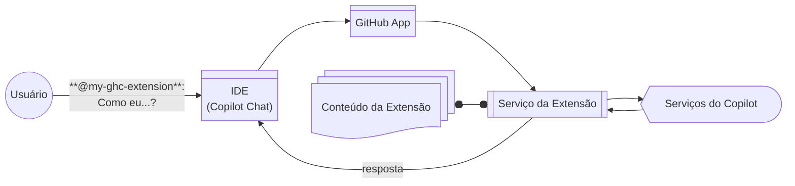

## Passo 1: Preparando-se para criar sua extensão

Bem-vindo ao exercício **"Sua primeira extensão para o GitHub Copilot"**! :robot:

Vamos criar uma extensão para o GitHub Copilot desenvolvendo um serviço web, conectando-o a um GitHub App e personalizando-o para nossas necessidades (a equipe de uma escola de ensino médio). Mas antes de começarmos, vamos aprender um pouco mais sobre extensões.

### O que é uma Extensão do GitHub Copilot?

Uma [Extensão do GitHub Copilot](https://github.com/features/copilot/extensions) é um complemento que fornece habilidades personalizadas para o GitHub Chat e o github.com. Isso significa que ela pode ser mais dinâmica e incluir contexto consistente.

Por exemplo:

- **Consultar documentação**: Uma Extensão do Copilot pode permitir que o Copilot Chat consulte um serviço de documentação de terceiros para encontrar informações sobre um tópico específico.
- **Codificação assistida por IA**: Uma Extensão do Copilot pode usar um modelo de IA de terceiros para fornecer sugestões de código.
- **Recuperação de dados**: Uma Extensão do Copilot pode permitir que o Copilot Chat consulte um serviço de dados de terceiros para recuperar informações sobre um tópico específico.
- **Execução de ações**: Uma Extensão do Copilot pode permitir que o Copilot Chat execute uma ação específica, como postar em um quadro de mensagens ou atualizar um item de acompanhamento em um sistema externo.

Na verdade, você pode até publicar sua extensão no [GitHub Marketplace](https://github.com/marketplace?type=apps&copilot_app=true) para compartilhá-la com o mundo!

> Ref: Para mais informações, veja a página [Sobre a criação de extensões](https://docs.github.com/pt/copilot/building-copilot-extensions/about-building-copilot-extensions).

### Como faço uma extensão?

Criar uma extensão é relativamente fácil. Inclui 3 partes, que vamos aprender nesta lição.
Naturalmente, o serviço web deve ser hospedado, mas isso é abordado em outra lição. Para este exercício, usaremos um [Codespace](https://github.com/features/codespaces).

1. **GitHub App** – Permite o tratamento de mensagens e a comunicação com o GitHub Copilot.
1. **Serviço da Extensão** – Um serviço web padrão para receber as mensagens, executar as ações personalizadas e responder ao GitHub Copilot.
1. **Conteúdo da Extensão** – Materiais fornecidos para sua extensão para personalizá-la para sua aplicação.

> [!IMPORTANTE]
> Uma [Extensão do GitHub Copilot](https://github.com/features/copilot/extensions) _NÃO_ é a [Extensão do GitHub Copilot para VS Code](https://marketplace.visualstudio.com/items?itemName=GitHub.copilot) encontrada no seu IDE, mas sim uma capacidade extra para aprimorá-lo.

### Ok, vamos começar a desenvolver! :mechanical_arm:

Antes de começarmos sua extensão, precisamos configurar nosso ambiente de desenvolvimento.
Felizmente, isso já foi preparado para nós com um [Codespace](https://github.com/features/codespaces) pré-configurado.

Este ambiente de desenvolvimento inclui:

- O runtime do Node.js.
- Um template de Extensão do GitHub (aplicação web em JavaScript).
- Configurações de inicialização do [VS Code](https://code.visualstudio.com/) para iniciar sua extensão em modo de depuração.

### :keyboard: Atividade: Conhecendo seu ambiente de desenvolvimento de extensões

1. Clique com o botão direito no botão abaixo para abrir a página **Criar Codespace** em uma nova aba.

   

   - O nível gratuito do Codespaces, disponível para todas as contas do GitHub, é suficiente, desde que você ainda tenha minutos disponíveis.
   - As configurações padrão do Codespace são adequadas.
   - Este repositório fornecerá as configurações e arquivos adicionais para criar sua extensão.

1. Confirme que o campo **Repositório** é a sua cópia do exercício, não o original, depois clique no botão verde **Create Codespace**.

   - ✅ Sua cópia: `/{{full_repo_name}}`
   - ❌ Original: `/skills/your-first-extension-for-github-copilot`

1. Aguarde um momento para o Visual Studio Code carregar.

1. Antes de continuarmos, vamos nos familiarizar com a pasta do projeto.

   - A barra de navegação à esquerda é onde você pode acessar o explorador de arquivos, o depurador e a busca.
   - O painel inferior (Ctrl+J) mostra a saída do depurador, permite executar comandos no terminal e configurar as portas do serviço web.
   - Nossa extensão modelo está na pasta `ghc-extension-js`. Mais sobre isso nos próximos passos!
   - O arquivo `index.js` é o ponto de entrada da extensão e hospeda o serviço web para o Copilot interagir.
   - Os arquivos `package-lock.json` e `package.json` definem as dependências da extensão.

1. Crie um novo branch chamado `my-ghc-extension`. Certifique-se de que ele está selecionado no VS Code e publicado no GitHub.

   - Nota: Criar esse branch aciona o próximo passo do seu exercício.
